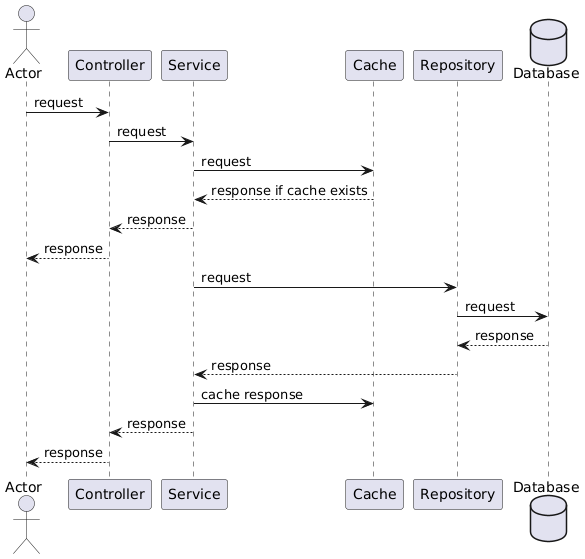
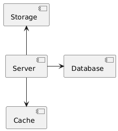
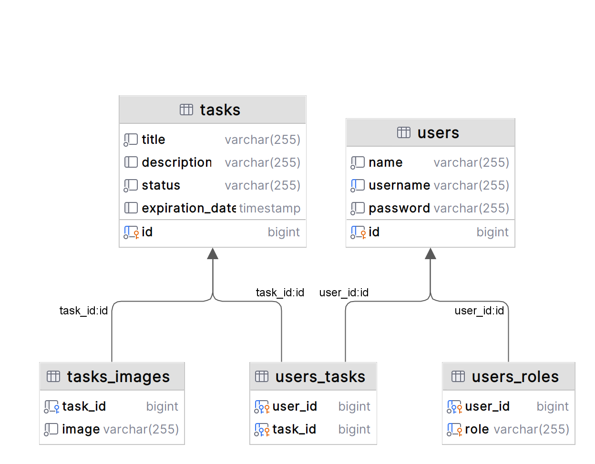

# Tasklist-rest-spring-boot
Application implements basic functionality for working with task and users.

For looking all endpoint you can open `http://localhost:8080/swagger-ui/index.html`.

### Prerequisites: [Java 21](https://jdk.java.net/21/), [Maven](https://maven.apache.org/), [PostgreSQL](https://www.postgresql.org/), [Docker](https://www.docker.com/), [Swagger](https://inlnk.ru/O1g6M4), [Spring Security](https://spring.io/projects/spring-security), [Redis](https://redis.io/), [Liquibase](https://www.liquibase.com/), [MyBatis](https://mybatis.org/mybatis-3/), [Hibernate JPA](https://hibernate.org/), [MinIO](https://min.io/), [GraphQL](https://graphql.org/), [Sending Email](https://docs.spring.io/spring-boot/reference/io/email.html)

## Description
Application include two main classes: `User` and `Task`. 

`User` class represents user in this application. User can log in and refresh his secret token to access the app, as well as interact with tasks: create, add, update and delete.

`User` can have roles - `ROLE_USER` and `ROLE_ADMIN`, what makes it possible to obtain certain data.

`Task` class represents task in this application. Task can have images.

The security of the application is based on authentication using `JWT tokens`.

The application contains integration with `GraphQl`.

The application have a `MailService` which sends emails to new users after registration and sends reminders about the expiration of tasks.

## Sequence diagram



## Component diagram



## Class diagram



## Environments

To run this application you need to create `.env` file in root directory with next environments:

* `POSTGRES_HOST` - host of Postgresql database
* `POSTGRES_USERNAME` - username for Postgresql database
* `POSTGRES_PASSWORD` - password for Postgresql database
* `POSTGRES_DATABASE` - name of Postgresql database
* `POSTGRES_SCHEMA` - name of Postgresql schema
* `REDIS_HOST` - host of Redis instance
* `REDIS_PASSWORD` - password for Redis
* `JWT_SECRET` - secret string for JWT tokens
* `MINIO_BUCKET` - name of bucket for MinIO
* `MINIO_URL` - URL of MinIO instance
* `MINIO_ACCESS_KEY` - access key of MinIO
* `MINIO_SECRET_KEY` - secret key of MinIO
* `SPRING_MAIL_HOST` - host of mail sender
* `SPRING_MAIL_PORT` - the port on which the message from the mail will be listened to (default 587)
* `SPRING_MAIL_USERNAME` - address of mail sender
* `SPRING_MAIL_PASSWORD` - password for sending message from the sender's mail

You can use example .env.example file with some predefined environments.

## Getting started
### 1. Clone the repository
```shell
    git clone https://github.com/floMaxter/tasklist-rest-spring-boot.git
    cd tasklist-rest-spring-boot
````

or download zip archive

    https://github.com/floMaxter/tasklist-rest-spring-boot/archive/refs/heads/main.zip

This application can be started by `docker-dompose` using command:
```shell
docker compose up
```

or started by running each component individually in a `docker container` or `local machine`.

### 2. PostgreSQL
PostgreSQL is used to store information about tasks and users.

```shell
docker run --name tasklist-db -p 5433:5432 -e POSTGRES_USER=<your_user> -e POSTGRES_PASSWORD=<your_password> -e POSTGRES_DB=<your_db> postgres:16
```

> Note that the port in the database is not the default one

### 3. Redis
Redis is used to store requests in a cache.

```shell
docker run --name redis -p 6379:6379 -e REDIS_PASSWORD=<your_password> -v cache:/data redis:latest redis-server --save 20 1 --loglevel warning --requirepass ${REDIS_PASSWORD}
```
### 4. MinIO
MinIO is used for storage images (files) for Task.

```shell
docker run --name minio -p 9090:9090 -p 9000:9000 -e MINIO_ROOT_USER=<MINIO_ACCESS_KEY> -e MINIO_ROOT_PASSWORD=<MINIO_SECRET_KEY> -v minio-data:/minio minio/minio:latest server ~/minio --console-address :9090
```
